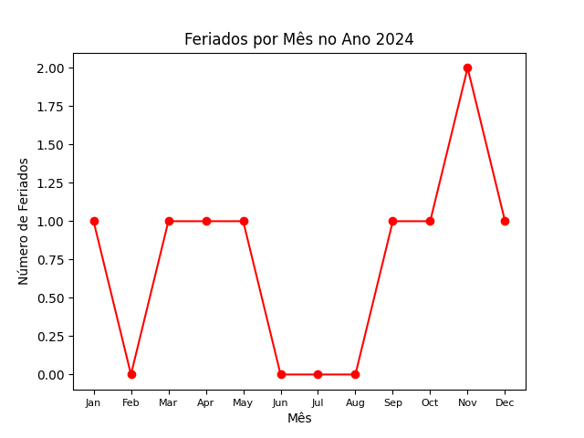

<h2 align="center"> Calendário dos feriado em 2024 em </h2>

O código Python apresenta um script que utiliza a biblioteca matplotlib para criar um gráfico de linha, mostrando a distribuição mensal de feriados ao longo de um ano específico.
O script utiliza a biblioteca holidays para obter informações sobre os feriados brasileiros.

<h3 align="center">⭐Detalhes do Código:⭐</h3>

<h4> Bibliotecas Utilizadas:</h4>

➡️matplotlib.pyplot: Usada para criar visualizações gráficas, neste caso, um gráfico de linha.

➡️holidays: Utilizada para obter informações sobre feriados brasileiros.

➡️collections.Counter: Usada para contar a frequência de feriados por mês.

➡️datetime.date: Utilizada para manipulação de datas.

<h4> Função plot_holidays(year):</h4>

➡️Recebe um ano como parâmetro.

➡️Obtém os feriados brasileiros para o ano especificado.

➡️Filtra apenas os feriados que ocorrem no ano determinado.

➡️Agrupa feriados por mês, contando sua ocorrência.

➡️Cria um gráfico de linha utilizando matplotlib.pyplot.

➡️Adiciona rótulos e título ao gráfico.

➡️Ajusta o tamanho da fonte dos meses no eixo x.

➡️Exibe o gráfico na tela.

  
<h4> Configuração do Gráfico:</h4>

➡️O gráfico exibe o número de feriados no eixo y e os meses no eixo x.

➡️Cada ponto no gráfico representa um mês e a quantidade de feriados nesse mês.

➡️Utiliza marcadores vermelhos ('o') e uma linha de ligação para facilitar a visualização.

  
<h4> Execução do Script:</h4>

➡️Substitua o ano desejado (no exemplo, 2024) na variável ano_desejado.

➡️Executa a função plot_holidays com o ano especificado.

➡️Salva o gráfico como uma imagem chamada 'calendario.png' (ou outro formato desejado).

  
<h4> Instruções para Execução:</h4>

➡️Execute o script no ambiente Python desejado (terminal, VSCode, Jupyter, etc.).

➡️Certifique-se de ter as bibliotecas matplotlib e holidays instaladas.

➡️O gráfico será exibido na tela e, opcionalmente, salvo como uma imagem.

  

Este código oferece uma maneira simples de visualizar a distribuição dos feriados brasileiros ao longo de um ano e pode ser útil para análises temporais.

